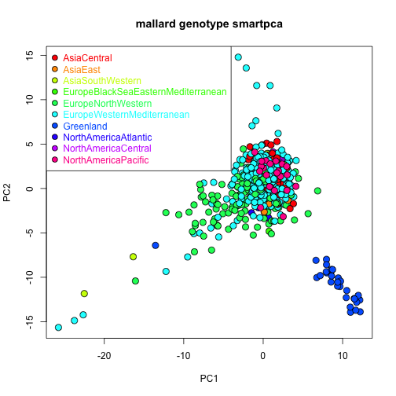

This Vignette provides an example analysis of genetic data using the smartsnp package.
  
## 1) Description of the data

Multivariate analysis of mallard genotypes using the dataset published by Kraus et al. 2013.

Paper = https://onlinelibrary.wiley.com/doi/10.1111/mec.12098 

Dataset = https://datadryad.org/stash/dataset/doi:10.5061/dryad.1bq39

Population SEAP removed from dataset as its geographic background is unclear (Robert Kraus, pers. comm., 02/06/2021).

Populations GBAB, GBFE and GBNM (British Isles) removed from dataset as these individuals might have mixed with captive/feral mallards (Robert Kraus, pers. comm., 03/06/2021).

Three datasets are available (none includes row names or column headings):

* Genotype data (mallard_genotype_Kraus2012.txt) = 364 SNPs (rows) x 695 individuals (columns), individuals comprise 55 populations and 10 flyways. Genotypes are 0, 1, 2 or (for missing values) 9
* Group names (mallard_samples_Kraus2013.txt) = 695 rows x 3 columns, column 1 = flyway names, column 2 = population name, column 3 = indvidual names comprise 55 populations and 10 flyways
* SNP names (mallard_snps_Kraus2013.txt) = 695 rows x 1 column

The study supports panmixia in cosmopolitan bird species (see Kraus et al. 2013):

"...Only Greenland is genetically differentiated from the remaining mallard 
population, and to a lesser extent, slight differentiation is observed between 
flyways in Europe and North America".

"...There is a lack of clear population structure, suggesting that the world's 
mallards, perhaps with minor exceptions, form a single large, mainly 
interbreeding population".


## 2) Install package *smartsnp* (use one option)

From GitHub:


```r
install.packages("devtools")
devtools::install_github("ChristianHuber/smartsnp")
```

From CRAN:


```r
install.packages("smartsnp")
```

## 3) Load package


```r
library(smartsnp)
```

## 4) Create group factor

Load group file (flyway = categorical predictor in PERMANOVA AND PERMDISP tests):


```r
pathToFile <- system.file("extdata", "mallard_samples_Kraus2013", package = "smartsnp")
my_groups <- c(data.table::fread(pathToFile, header = FALSE))[[1]]
length(my_groups) #number of individuals
#> [1] 695
length(table(my_groups)) #number of flyways
#> [1] 10
table(my_groups) #number of individuals per flyway
#> my_groups
#>                        AsiaCentral                           AsiaEast 
#>                                 51                                 12 
#>                   AsiaSouthWestern EuropeBlackSeaEasternMediterranean 
#>                                 15                                 21 
#>                 EuropeNorthWestern         EuropeWesternMediterranean 
#>                                147                                360 
#>                          Greenland               NorthAmericaAtlantic 
#>                                 29                                 16 
#>                NorthAmericaCentral                NorthAmericaPacific 
#>                                 22                                 22
```

Number of populations (not needed for analysis hereafter):


```r
my_pops <- c(data.table::fread(pathToFile, header = FALSE))[[2]]
length(table(my_pops)) #number of populations
#> [1] 55
table(my_pops) #number of individuals per population
#> my_pops
#>  ATHO  CACO  CAEK  CAJC  CALM  CARM  CASL  CNLI  CYLA  DEWU  EETA  FIOU  FOTO  FRAL  FRMV 
#>    25     4     4     1     7    20     2     5     5    27    22    19    24    10    32 
#>  GLIS  GLNU  GREV IR361 IR362 IR366  IR37 IR371 IR375 IR377   IR4 IR444 IR448 IR449 IR452 
#>     9    20    16     1     1     1     1     1     1     1     1     1     1     1     1 
#> IR454 IR513 IR514  ISHV  LTVE  NLFR  NOBE  NOSS  PKHA  PTDJ  RUIV  RUKH  RULE  RUNO  RUOM 
#>     1     1     1     4    17    32    32    16     7    32    27     7    31     8    12 
#>  RUTO  RUTV  RUVL  RUVO  RUYA  SEOB  SILJ  UADU  UALV  USMF 
#>    32    19    29    31    25    20    19     3     3    22
```

Code per individual (not needed for analysis hereafter):


```r
my_indv <- c(data.table::fread(pathToFile, header = FALSE))[[3]]
```

SNP names (not needed for analysis hereafter):


```r
pathToFile <- system.file("extdata", "mallard_snps_Kraus2013", package = "smartsnp")
my_snps <- c(data.table::fread(pathToFile, header = FALSE))[[1]]
length(my_snps) # number of snps
#> [1] 364
```

## 5) Run smart_pca (missing values with means, control for genetic drift)

Run PCA with truncated SVD (PCA 1 x PCA 2 axes) and assign results to object pcaR:


```r
pathToFile <- system.file("extdata", "mallard_genotype_Kraus2012", package = "smartsnp")
pcaR <- smart_pca(snp_data = pathToFile, sample_group = my_groups, missing_impute = "mean")
```

pcaR is a list with 3 elements:


```r
class(pcaR)
#> [1] "list"
names(pcaR)
#> [1] "pca.snp_loadings"       "pca.eigenvalues"        "pca.sample_coordinates"
str(pcaR)
#> List of 3
#>  $ pca.snp_loadings      :'data.frame':	363 obs. of  2 variables:
#>   ..$ PC1: num [1:363] -0.00485 0.01722 0.01528 -0.03058 -0.01299 ...
#>   ..$ PC2: num [1:363] 0.12022 0.02884 0.10416 0.03784 -0.00292 ...
#>  $ pca.eigenvalues       : num [1:3, 1:2] 14.24 1.93 1.93 11.89 1.61 ...
#>   ..- attr(*, "dimnames")=List of 2
#>   .. ..$ : chr [1:3] "observed eigenvalues" "variance explained" "cumulative variance explained"
#>   .. ..$ : chr [1:2] "PC1" "PC2"
#>  $ pca.sample_coordinates:'data.frame':	695 obs. of  4 variables:
#>   ..$ Group: chr [1:695] "EuropeWesternMediterranean" "EuropeWesternMediterranean" "EuropeWesternMediterranean" "EuropeWesternMediterranean" ...
#>   ..$ Class: chr [1:695] "PCA" "PCA" "PCA" "PCA" ...
#>   ..$ PC1  : num [1:695] 1.194 1.654 -1.152 1.489 -0.976 ...
#>   ..$ PC2  : num [1:695] 2.42 2.86 3.31 3.9 3.21 ...
```

Assign statistical results to objects pcaR_eigen, pcaR_load and pcaR_coord:


```r
pcaR_eigen <- pcaR$pca.eigenvalues # extract eigenvalues (PCA1 and PC2 axes explain 3.5% variation in SNP variation across individuals)
pcaR_load <- pcaR$pca.snp_loadings # extract principal coefficients (hitg SNP loadings indicate loci with stronger variation across individuals)
pcaR_coord <- pcaR$pca.sample_coordinates # extract principal components (position of individuals in PCA space used to generate the ordination)
```

Plot PCA:


```r
cols <- rainbow(length(table(my_groups)))
plot(pcaR$pca.sample_coordinates[,c("PC1","PC2")], cex = 1.5, 
     bg = cols[as.factor(my_groups)], pch = 21, col = "black", main = "mallard genotype smartpca")
legend("topleft", legend = levels(as.factor(my_groups)), cex = 1, pch = 21, 
       pt.cex = 1.25, col = "black", pt.bg = cols, text.col = cols)
```



Greenland individuals cluster in one of the corners of the ordination, supporting a distinct SNP composition relative to the remaining flyways.


## 6) Run smart_permanova (missing values imputed with means, control for genetic drift, global and pairwise tests applied)

Run PERMANOVA test (group location in PCA1 x PCA2 space) and assign results to object permanovaR
Notice that pairwise tests increase computing time considerably as there are 45 pairwise comparisons to make for 10 flyways, each calculating a p value based on 10,000 permutations of the data


```r
pathToFile <- system.file("extdata", "mallard_genotype_Kraus2012", package = "smartsnp")
permanovaR <- smart_permanova(snp_data = pathToFile, sample_group = my_groups, 
                              target_space = "pca", missing_impute = "mean", pairwise = "TRUE")
```

permanovaR is a list with 5 elements:


```r
class(permanovaR)
#> [1] "list"
names(permanovaR)
#> [1] "permanova.samples"             "permanova.global_test"        
#> [3] "permanova.pairwise_test"       "permanova.pairwise_correction"
#> [5] "permanova.permutation_number"  "permanova.permutation_seed"
str(permanovaR)
#> List of 6
#>  $ permanova.samples            :'data.frame':	695 obs. of  2 variables:
#>   ..$ Group: chr [1:695] "EuropeWesternMediterranean" "EuropeWesternMediterranean" "EuropeWesternMediterranean" "EuropeWesternMediterranean" ...
#>   ..$ Class: chr [1:695] "PERMANOVA" "PERMANOVA" "PERMANOVA" "PERMANOVA" ...
#>  $ permanova.global_test        :Classes 'anova' and 'data.frame':	3 obs. of  6 variables:
#>   ..$ Df       : num [1:3] 9 685 694
#>   ..$ SumsOfSqs: num [1:3] 6982 11151 18133
#>   ..$ MeanSqs  : num [1:3] 775.7 16.3 NA
#>   ..$ F.Model  : num [1:3] 47.7 NA NA
#>   ..$ R2       : num [1:3] 0.385 0.615 1
#>   ..$ Pr(>F)   : num [1:3] 1e-04 NA NA
#>  $ permanova.pairwise_test      :'data.frame':	45 obs. of  5 variables:
#>   ..$ GroupPair        : chr [1:45] "AsiaCentral-AsiaEast" "AsiaCentral-AsiaSouthWestern" "AsiaCentral-EuropeBlackSeaEasternMediterranean" "AsiaCentral-EuropeNorthWestern" ...
#>   ..$ F.Model          : num [1:45] 1.366 4.547 0.672 34.286 4.738 ...
#>   ..$ R2               : num [1:45] 0.0219 0.06633 0.00951 0.14888 0.01145 ...
#>   ..$ P.value          : num [1:45] 0.2505 0.0414 0.5117 0.0001 0.0211 ...
#>   ..$ P.value.corrected: num [1:45] 1 0.8694 1 0.0045 0.5408 ...
#>  $ permanova.pairwise_correction: chr "holm"
#>  $ permanova.permutation_number : num 9999
#>  $ permanova.permutation_seed   : num 1
```

Assign sample summary to object permP


```r
permP <- permanovaR$permanova.samples
```

Show PERMANOVA tables (global and pairwise):


```r
permanovaR$permanova.global_test
#>            Df SumsOfSqs MeanSqs F.Model      R2 Pr(>F)    
#> group       9    6981.7  775.74  47.653 0.38503  1e-04 ***
#> Residuals 685   11151.1   16.28         0.61497           
#> Total     694   18132.8                 1.00000           
#> ---
#> Signif. codes:  0 '***' 0.001 '**' 0.01 '*' 0.05 '.' 0.1 ' ' 1
```

For the mallard dataset, the p value is 1e-04.
As with other frequentist tests, p values should be interpreted as the probability of the observed differences if the null hypothesis of no differences between groups is true.
The lower the p value, the weaker the support for the null hypothesis.


```r
head(permanovaR$permanova.pairwise_test)
#>                                        GroupPair     F.Model          R2 P.value
#> 1                           AsiaCentral-AsiaEast   1.3655903 0.021896534  0.2505
#> 2                   AsiaCentral-AsiaSouthWestern   4.5468589 0.066332126  0.0414
#> 3 AsiaCentral-EuropeBlackSeaEasternMediterranean   0.6718692 0.009506883  0.5117
#> 4                 AsiaCentral-EuropeNorthWestern  34.2856122 0.148882997  0.0001
#> 5         AsiaCentral-EuropeWesternMediterranean   4.7384432 0.011452751  0.0211
#> 6                          AsiaCentral-Greenland 314.3271374 0.801186325  0.0001
#>   P.value.corrected
#> 1            1.0000
#> 2            0.8694
#> 3            1.0000
#> 4            0.0045
#> 5            0.5408
#> 6            0.0045
```

The lowest p values (resulting from pairwise comparisons) consistently occur between the Greenland and the remaining flyways, supporting a unique SNP composition mostly in Greenland mallards

## 7) Run smart_permdisp (missing values imputed with means, control for genetic drift, global and pairwise tests applied, dispersion adjusted to control for sample size per group)

Run PERMDISP test (group dispersion in PCA1 x PCA2 space) and assign results to object permdispR. Heteroscededasticity tests in combination with ANOVA tests tell whether the ANOVA F statistic is driven by mean and/or varinance differences among groups in a univariate context. Location and dispersion (multivariate context) are analogous with mean and variance in a univariate context. As the number per individuals per flyway differ a great deal among flyways, PERMDISP is run to control for sample-size bias (samplesize_bias = TRUE).


```r
pathToFile <- system.file("extdata", "mallard_genotype_Kraus2012", package = "smartsnp")
permdispR <- smart_permdisp(snp_data = pathToFile, sample_group = my_groups, 
                            target_space = "pca", missing_impute = "mean", pairwise = "TRUE", samplesize_bias = TRUE)
```

permdispR is a list with 7 elements:


```r
class(permdispR)
#> [1] "list"
names(permdispR)
#> [1] "permdisp.samples"             "permdisp_bias"               
#> [3] "permdisp.group_location"      "permdisp.global_test"        
#> [5] "permdisp.pairwise_test"       "permdisp.pairwise_correction"
#> [7] "permdisp.permutation_number"  "permdisp.permutation_seed"
str(permdispR)
#> List of 8
#>  $ permdisp.samples            :'data.frame':	695 obs. of  3 variables:
#>   ..$ Group            : chr [1:695] "EuropeWesternMediterranean" "EuropeWesternMediterranean" "EuropeWesternMediterranean" "EuropeWesternMediterranean" ...
#>   ..$ Class            : chr [1:695] "PERMDISP" "PERMDISP" "PERMDISP" "PERMDISP" ...
#>   ..$ Sample_dispersion: num [1:695] 1.91 2.53 2.85 3.36 2.68 ...
#>  $ permdisp_bias               : chr "Dispersion adjusted to number of samples per group"
#>  $ permdisp.group_location     : num [1:10, 1:2] 0.956 1.739 0.963 0.71 -1.464 ...
#>   ..- attr(*, "dimnames")=List of 2
#>   .. ..$ : chr [1:10] "AsiaCentral" "AsiaEast" "AsiaSouthWestern" "EuropeBlackSeaEasternMediterranean" ...
#>   .. ..$ : chr [1:2] "PCoA1" "PCoA2"
#>  $ permdisp.global_test        :'data.frame':	2 obs. of  5 variables:
#>   ..$ Df     : int [1:2] 9 685
#>   ..$ Sum Sq : num [1:2] 258 6128
#>   ..$ Mean Sq: num [1:2] 28.7 8.95
#>   ..$ F      : num [1:2] 3.21 NA
#>   ..$ Pr(>F) : num [1:2] 0.0073 NA
#>  $ permdisp.pairwise_test      :'data.frame':	45 obs. of  4 variables:
#>   ..$ GroupPair        : chr [1:45] "AsiaCentral-AsiaEast" "AsiaCentral-AsiaSouthWestern" "AsiaCentral-EuropeBlackSeaEasternMediterranean" "AsiaCentral-EuropeNorthWestern" ...
#>   ..$ F.Model          : num [1:45] 0.00367 5.20981 0.13897 20.46506 1.93196 ...
#>   ..$ P.value          : num [1:45] 0.9527 0.0293 0.7053 0.0001 0.1502 ...
#>   ..$ P.value.corrected: num [1:45] 1 1 1 0.0045 1 1 1 1 1 1 ...
#>  $ permdisp.pairwise_correction: chr "holm"
#>  $ permdisp.permutation_number : num 9999
#>  $ permdisp.permutation_seed   : num 1
```

Assign sample summary to object permD, where column Sample_dispersion column show dispersion of individuals relative to their flyway:


```r
permD <- permdispR$permdisp.samples
```

Show PERMDISP tables (global and pairwise):


```r
permdispR$permdisp.global_test
#>            Df    Sum Sq   Mean Sq       F Pr(>F)
#> Groups      9  258.2757 28.697299 3.20762 0.0073
#> Residuals 685 6128.4218  8.946601      NA     NA
```

For the mallard dataset, the p value is 0.0073:


```r
str(permdispR$permdisp.pairwise_test)
#> 'data.frame':	45 obs. of  4 variables:
#>  $ GroupPair        : chr  "AsiaCentral-AsiaEast" "AsiaCentral-AsiaSouthWestern" "AsiaCentral-EuropeBlackSeaEasternMediterranean" "AsiaCentral-EuropeNorthWestern" ...
#>  $ F.Model          : num  0.00367 5.20981 0.13897 20.46506 1.93196 ...
#>  $ P.value          : num  0.9527 0.0293 0.7053 0.0001 0.1502 ...
#>  $ P.value.corrected: num  1 1 1 0.0045 1 1 1 1 1 1 ...
```

Most PERMDISP pairwise tests show relatively high p values (i.e., high probability of the observed differences in dispersion if the null hypothesis of no dispersion differences among groups is true),  indicating that PERMANOVA tests mainly captured differences in location. The lowest p values for the PERMDISP pairwise tests for Eurasian flyways occur for the Europe North Western (ENW) flyway versus the other flyways as seen in the ordination plot (i.e., ENW individuals are widely spread over both the PCA1 and PCA2 axes).


## 8) Run smart_mva (missing values imputed with means, control for genetic drift, dispersion adjusted to control for sample size per group)

Run PCA, and PERMANOVA and PERMDISP tests (group location and dispersion in PCA1 x PCA2 space), and assign results to object mvaR. No pairwise comparisons are applied (default: pairwise = "FALSE"), so computation will be relatively fast. This is a wrapper function running in one single job the three other functions of the package (smart_pca, smart_permanova, smart_permdisp).


```r
pathToFile <- system.file("extdata", "mallard_genotype_Kraus2012", package = "smartsnp")
mvaR <- smart_mva(snp_data = pathToFile, sample_group = my_groups, 
                            target_space = "pca", missing_impute = "mean", samplesize_bias = TRUE)
```
                            
mvaR is a list with three elements (data, pca, test):


```r
class(mvaR)
#> [1] "list"
names(mvaR)
#> [1] "data" "pca"  "test"
str(mvaR)
#> List of 3
#>  $ data: num [1:363, 1:695] -1.13 1.31 2.05 -1.33 -0.81 ...
#>  $ pca :List of 3
#>   ..$ pca.snp_loadings      :'data.frame':	363 obs. of  2 variables:
#>   .. ..$ PC1: num [1:363] -0.00485 0.01722 0.01528 -0.03058 -0.01299 ...
#>   .. ..$ PC2: num [1:363] 0.12022 0.02884 0.10416 0.03784 -0.00292 ...
#>   ..$ pca.eigenvalues       : num [1:3, 1:2] 14.24 1.93 1.93 11.89 1.61 ...
#>   .. ..- attr(*, "dimnames")=List of 2
#>   .. .. ..$ : chr [1:3] "observed eigenvalues" "variance explained" "cumulative variance explained"
#>   .. .. ..$ : chr [1:2] "PC1" "PC2"
#>   ..$ pca.sample_coordinates:'data.frame':	695 obs. of  4 variables:
#>   .. ..$ Group: chr [1:695] "EuropeWesternMediterranean" "EuropeWesternMediterranean" "EuropeWesternMediterranean" "EuropeWesternMediterranean" ...
#>   .. ..$ Class: chr [1:695] "PCA" "PCA" "PCA" "PCA" ...
#>   .. ..$ PC1  : num [1:695] 1.194 1.654 -1.152 1.489 -0.976 ...
#>   .. ..$ PC2  : num [1:695] 2.42 2.86 3.31 3.9 3.21 ...
#>  $ test:List of 10
#>   ..$ test_samples            :'data.frame':	695 obs. of  3 variables:
#>   .. ..$ Group            : chr [1:695] "EuropeWesternMediterranean" "EuropeWesternMediterranean" "EuropeWesternMediterranean" "EuropeWesternMediterranean" ...
#>   .. ..$ Class            : chr [1:695] "PERMANOVA/PERMDISP" "PERMANOVA/PERMDISP" "PERMANOVA/PERMDISP" "PERMANOVA/PERMDISP" ...
#>   .. ..$ Sample_dispersion: num [1:695] 1.91 2.53 2.85 3.36 2.68 ...
#>   ..$ permanova.global_test   :Classes 'anova' and 'data.frame':	3 obs. of  6 variables:
#>   .. ..$ Df       : num [1:3] 9 685 694
#>   .. ..$ SumsOfSqs: num [1:3] 6982 11151 18133
#>   .. ..$ MeanSqs  : num [1:3] 775.7 16.3 NA
#>   .. ..$ F.Model  : num [1:3] 47.7 NA NA
#>   .. ..$ R2       : num [1:3] 0.385 0.615 1
#>   .. ..$ Pr(>F)   : num [1:3] 1e-04 NA NA
#>   ..$ permanova.pairwise_test : chr "No PERMANOVA pairwise tests implemented"
#>   ..$ permdisp.global_test    :'data.frame':	2 obs. of  5 variables:
#>   .. ..$ Df     : int [1:2] 9 685
#>   .. ..$ Sum Sq : num [1:2] 258 6128
#>   .. ..$ Mean Sq: num [1:2] 28.7 8.95
#>   .. ..$ F      : num [1:2] 3.21 NA
#>   .. ..$ Pr(>F) : num [1:2] 0.0095 NA
#>   ..$ permdisp.pairwise_test  : chr "No PERMDISP pairwise tests implemented"
#>   ..$ permdisp.bias           : chr "Dispersion adjusted to number of samples per group"
#>   ..$ permdisp.group_location : num [1:10, 1:2] 0.956 1.739 0.963 0.71 -1.464 ...
#>   .. ..- attr(*, "dimnames")=List of 2
#>   .. .. ..$ : chr [1:10] "AsiaCentral" "AsiaEast" "AsiaSouthWestern" "EuropeBlackSeaEasternMediterranean" ...
#>   .. .. ..$ : chr [1:2] "PCoA1" "PCoA2"
#>   ..$ test.pairwise_correction: chr "holm"
#>   ..$ test.permutation_number : num 9999
#>   ..$ test.permutation_seed   : num 1
```

Element 1 = scaled dataset (none, covariance, correlation, drift) in a matrix and array (rows = SNPs, columns = samples):


```r
class(mvaR$data)
#> [1] "matrix" "array"
dim(mvaR$data)
#> [1] 363 695
str(mvaR$data)
#>  num [1:363, 1:695] -1.13 1.31 2.05 -1.33 -0.81 ...
```

Element 2 = PCA results in a list:


```r
class(mvaR$pca)
#> [1] "list"
names(mvaR$pca)
#> [1] "pca.snp_loadings"       "pca.eigenvalues"        "pca.sample_coordinates"
str(mvaR$pca)
#> List of 3
#>  $ pca.snp_loadings      :'data.frame':	363 obs. of  2 variables:
#>   ..$ PC1: num [1:363] -0.00485 0.01722 0.01528 -0.03058 -0.01299 ...
#>   ..$ PC2: num [1:363] 0.12022 0.02884 0.10416 0.03784 -0.00292 ...
#>  $ pca.eigenvalues       : num [1:3, 1:2] 14.24 1.93 1.93 11.89 1.61 ...
#>   ..- attr(*, "dimnames")=List of 2
#>   .. ..$ : chr [1:3] "observed eigenvalues" "variance explained" "cumulative variance explained"
#>   .. ..$ : chr [1:2] "PC1" "PC2"
#>  $ pca.sample_coordinates:'data.frame':	695 obs. of  4 variables:
#>   ..$ Group: chr [1:695] "EuropeWesternMediterranean" "EuropeWesternMediterranean" "EuropeWesternMediterranean" "EuropeWesternMediterranean" ...
#>   ..$ Class: chr [1:695] "PCA" "PCA" "PCA" "PCA" ...
#>   ..$ PC1  : num [1:695] 1.194 1.654 -1.152 1.489 -0.976 ...
#>   ..$ PC2  : num [1:695] 2.42 2.86 3.31 3.9 3.21 ...
```

Show PCA results:


```r
head(mvaR$pca$pca.eigenvalues) #extract eigenvalues
#>                                     PC1       PC2
#> observed eigenvalues          14.235721 11.892240
#> variance explained             1.925574  1.608587
#> cumulative variance explained  1.925574  3.534161
head(mvaR$pca$pca.sample_coordinates) #extract coordinates of individuals in PCA1 x PCA2 space
#>                        Group Class        PC1      PC2
#> 1 EuropeWesternMediterranean   PCA  1.1936564 2.420538
#> 2 EuropeWesternMediterranean   PCA  1.6540335 2.857820
#> 3 EuropeWesternMediterranean   PCA -1.1522899 3.311944
#> 4 EuropeWesternMediterranean   PCA  1.4886777 3.895509
#> 5 EuropeWesternMediterranean   PCA -0.9762505 3.214546
#> 6 EuropeWesternMediterranean   PCA -0.3518813 2.273576
head(mvaR$pca$pca.snp_loadings) #extract SNP loadings
#>            PC1          PC2
#> 1 -0.004845369  0.120219092
#> 2  0.017218374  0.028841552
#> 3  0.015280677  0.104157428
#> 4 -0.030582459  0.037843697
#> 5 -0.012987416 -0.002920648
#> 6 -0.098992766 -0.028586880
```

Element 3 = PERMANOVA and PERMDISP results in a list:


```r
class(mvaR$test)
#> [1] "list"
names(mvaR$test)
#>  [1] "test_samples"             "permanova.global_test"    "permanova.pairwise_test" 
#>  [4] "permdisp.global_test"     "permdisp.pairwise_test"   "permdisp.bias"           
#>  [7] "permdisp.group_location"  "test.pairwise_correction" "test.permutation_number" 
#> [10] "test.permutation_seed"
str(mvaR$test)
#> List of 10
#>  $ test_samples            :'data.frame':	695 obs. of  3 variables:
#>   ..$ Group            : chr [1:695] "EuropeWesternMediterranean" "EuropeWesternMediterranean" "EuropeWesternMediterranean" "EuropeWesternMediterranean" ...
#>   ..$ Class            : chr [1:695] "PERMANOVA/PERMDISP" "PERMANOVA/PERMDISP" "PERMANOVA/PERMDISP" "PERMANOVA/PERMDISP" ...
#>   ..$ Sample_dispersion: num [1:695] 1.91 2.53 2.85 3.36 2.68 ...
#>  $ permanova.global_test   :Classes 'anova' and 'data.frame':	3 obs. of  6 variables:
#>   ..$ Df       : num [1:3] 9 685 694
#>   ..$ SumsOfSqs: num [1:3] 6982 11151 18133
#>   ..$ MeanSqs  : num [1:3] 775.7 16.3 NA
#>   ..$ F.Model  : num [1:3] 47.7 NA NA
#>   ..$ R2       : num [1:3] 0.385 0.615 1
#>   ..$ Pr(>F)   : num [1:3] 1e-04 NA NA
#>  $ permanova.pairwise_test : chr "No PERMANOVA pairwise tests implemented"
#>  $ permdisp.global_test    :'data.frame':	2 obs. of  5 variables:
#>   ..$ Df     : int [1:2] 9 685
#>   ..$ Sum Sq : num [1:2] 258 6128
#>   ..$ Mean Sq: num [1:2] 28.7 8.95
#>   ..$ F      : num [1:2] 3.21 NA
#>   ..$ Pr(>F) : num [1:2] 0.0095 NA
#>  $ permdisp.pairwise_test  : chr "No PERMDISP pairwise tests implemented"
#>  $ permdisp.bias           : chr "Dispersion adjusted to number of samples per group"
#>  $ permdisp.group_location : num [1:10, 1:2] 0.956 1.739 0.963 0.71 -1.464 ...
#>   ..- attr(*, "dimnames")=List of 2
#>   .. ..$ : chr [1:10] "AsiaCentral" "AsiaEast" "AsiaSouthWestern" "EuropeBlackSeaEasternMediterranean" ...
#>   .. ..$ : chr [1:2] "PCoA1" "PCoA2"
#>  $ test.pairwise_correction: chr "holm"
#>  $ test.permutation_number : num 9999
#>  $ test.permutation_seed   : num 1
```

Multiple-testing correction applied:


```r
mvaR$test$test.pairwise_correction
#> [1] "holm"
```

Number of permutations to estimate p value:


```r
mvaR$test$test.permutation_number
#> [1] 9999
```

Seed for random generator:


```r
mvaR$test$test.permutation_seed
#> [1] 1
```

Summary of samples:


```r
head(mvaR$test$test_samples)
#>                        Group              Class Sample_dispersion
#> 1 EuropeWesternMediterranean PERMANOVA/PERMDISP          1.905208
#> 2 EuropeWesternMediterranean PERMANOVA/PERMDISP          2.525640
#> 3 EuropeWesternMediterranean PERMANOVA/PERMDISP          2.846770
#> 4 EuropeWesternMediterranean PERMANOVA/PERMDISP          3.357369
#> 5 EuropeWesternMediterranean PERMANOVA/PERMDISP          2.679859
#> 6 EuropeWesternMediterranean PERMANOVA/PERMDISP          1.566851
```

Show PERMANOVA table:


```r
mvaR$test$permanova.global_test #global test
#>            Df SumsOfSqs MeanSqs F.Model      R2 Pr(>F)    
#> group       9    6981.7  775.74  47.653 0.38503  1e-04 ***
#> Residuals 685   11151.1   16.28         0.61497           
#> Total     694   18132.8                 1.00000           
#> ---
#> Signif. codes:  0 '***' 0.001 '**' 0.01 '*' 0.05 '.' 0.1 ' ' 1
mvaR$test$permanova.pairwise_test #pairwise tests
#> [1] "No PERMANOVA pairwise tests implemented"
```

Show PERMDISP table:


```r
mvaR$test$permdisp.global_test #global test
#>            Df    Sum Sq   Mean Sq       F Pr(>F)
#> Groups      9  258.2757 28.697299 3.20762 0.0095
#> Residuals 685 6128.4218  8.946601      NA     NA
mvaR$test$test$permdisp.pairwise_test #pairwise tests
#> NULL
```

Sample-size correction applied:


```r
mvaR$test$permdisp.bias
#> [1] "Dispersion adjusted to number of samples per group"
```

Location of flyways in ordination:


```r
mvaR$test$permdisp.group_location
#>                                          PCoA1      PCoA2
#> AsiaCentral                         0.95606738 -1.0223659
#> AsiaEast                            1.73944124 -1.4799962
#> AsiaSouthWestern                    0.96254119 -1.2005153
#> EuropeBlackSeaEasternMediterranean  0.70978842 -1.0906961
#> EuropeNorthWestern                 -1.46377155  0.5649683
#> EuropeWesternMediterranean          0.18849627 -0.8051776
#> Greenland                           9.37848059 10.5513341
#> NorthAmericaAtlantic               -0.03785058 -0.3764883
#> NorthAmericaCentral                 1.61458028 -2.6342789
#> NorthAmericaPacific                 1.38064146 -1.7098544
```


